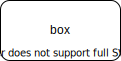

This is WIP.  

I am "thinking aloud" about the primitive elements of software.

I expect that the contents of this note will change with feedback and further thought.

I do, though, believe in "showing my work".  Showing intermediate results, no matter how rough.

Although this article is fresh, these ideas have been percolating for several decades, influenced by my experiences in running a small software consultancy. 

# Atoms
## Case on Type
OO method
## Case on State
state transition
## Case on Data Pattern
parse
phrase (history)
	- a data phrase is just (1) store datums (history), (2) case on bag of datums
(aka Case on Bag(Datum))
## Iteration
(Recursion is the mother of all iteration (pointed out to me by Nils Holm))
### Termination
### Non-Termination
# Molecules
- nested
	- scoping
	- inheritance
	- StateChart nesting
	- Russian Dolls
	- namespaces
	- package managers
- spaghetti
	- unrestricted function calls
	- unrestricted GOTO
# Energy
## Control Flow
### Synchronous Transfer
- Call (GOTO)
- Return (GOTO)
### Asynchronous Transfer
- Invoke
- Yield
# Composition (Molecules)
# Data
- Datum (singular)
- Bag (plural, unordered)
- Proc (unit of execution, aka lambda w/o parameters and w/o retaddr)

- Allocation
	- alloc (new, var, let, malloc)
	- free (out-of-scope, GC, free)
	- fast access
		- registers
		- RAM
	- slower access
		- file
	- slow access
		- distributed (internet)

- ownership
	- scoped
	- handle
	- global

- when allocated
	- pre-allocated
	- dynamic allocation
		- nested
		- heap

- delivery - when delivered
	- Send()

- how delivered
	- by value
	- by reference

- data delilvery

- data kind
	- text
	- diagram
	- A.I. (trained)

# Control Flow Composition
- sync
- async

- nested
- spaghetti

# Examples
[[Call]]
[[Return]]
[[CPS (Continuation Passing Style)]]
[[Theorem Provers, Correctness, Etc.]]

# Experiment
svg for obsidian ![[box 1.svg]]
svg fo github 
video for obsidian ![[Screen Recording 2022-01-02 at 8.11.53 AM.mov]]
